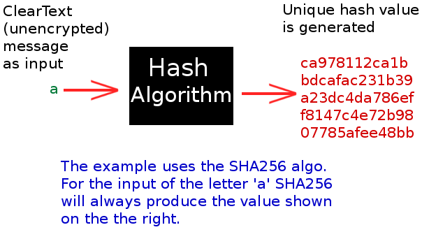
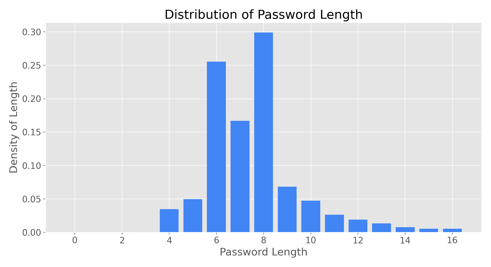

# Context

At some point in all of our lives we've received one of the following -
A notification that flashes across your phone or pops into your inbox. . .

>Dear Customer, \
We’re letting you know that we have detected unusual activity on your account and are taking action to. . .

“Was my information stolen from my bank, my employer, or could it be from that one website I love to read at night”? [1](#website)

How the bad-guys managed to steal or purchase your information, you’ll never know for sure.  Out of all the ways you can better protect yourself and your family against cyber criminals, there is one piece of advice you’ve heard the most.  It’s also the one you’ve actually agreed with, told yourself you’d commit to, but then promptly decided to put it off again. . .

Until the news of another data breach slides across your phone. [2](#breachnotice)

---

Create a strong password!

---

### How Does A Password Get Cracked?

When you create a password for an account, the majority of service companies are now immediately use a hashing algorithm to turn your plaintext password into a "hash". This hash is unique to your password and cannot be undone to identify your password if it is stolen or leaked from a database. This sounds like it should be a secure solution, but when a hacker receives stolen password hashes from a company, they have already determined which hashing algorithm that company used. The hacker then runs billions of password guesses through the same hashing algorithm to see if any hashes are a match - effectively identifying what the original passwords were.

---
So what does it take to make a strong password anyway?

- Should you include that specific date that you haven’t told anyone?
- Or the amount of fancy characters you can find on your keyboard?
- Or perhaps the cat ladies of the world have the true secret to fighting cyber criminals after all - just make a password with all of the names of your cats :smiley_cat: :smiley_cat:.[3](#cat_lady)

---

## Data Pipeline

I have analyzed a dataset of ten million unique passwords in an attempt to answer the questions above.
\
The dataset used for this first project comes from the [10-million passwords](https://xato.net/today-i-am-releasing-ten-million-passwords-b6278bbe7495) dataset generously published by Mark Burnett [6](#mark)

This dataset had only the password plaintext available as a feature, so all analysis had to occur from creating new features, the code for which has been provided.

Features Created

   1. length of password
   2. count of character types used
      - lowercase, numbers, uppercase, symbols
   3. guesses_log10
      - Measure of **Password Strength**
      - Estimated number of max guesses to identify a password
   4. score
      1. Simplified version of guesses
      2. Useful as feedback during new-password creation
      3. Promotes stronger passwords

## Assumptions for time estimates

These times were calculated with the following assumptions:

1. The attacker is commencing an offline bruteforce attack
   - He already has your password's hash from the company server
   - The only thing slowing his time to crack it is:
     - **Your password's strength!**
     - His computer's capability
     - The company's use of hashing algorithm (fast/slow)
2. The company opted for the slower (more secure) hashing algorithm
3. Resulting in 10K Guesses/Second
   - A fast hash would result in about 16B Guesses/Second

| Guesses_log | Time to Crack| Score  |
| ----:       | -----------: |:-----: |
|  14         |  <300 years  |        |
|  13         |   30 years   |        |
|  12         |    3 years   |        |
|  11         |    4 months  |    4   |
|  10         |    2 weeks   |    3   |
|  8          |    3 hours   |    2   |
|  7          |   10 minutes |    1   |
|  6          |   <1 minute  |    0   |

## Goals

Using the features created, I sought to accomplish the following:

1. Provide you examples of strong and weak passwords.
2. Help you understand how to make a strong password
3. Motivate you to never again have ~~low-hanging fruit~~ weak passwords for a hacker to profit from.

### And the Technical Stuff

4. Create a novel data pipeline to prepare the datasets to a common standard.
5. Practice methods of data manipulation that scale well with datasets in excess of 3-25GB (e.g. Dask, PySpark)
6. Create code using Object-Oriented Principles that can be further developed in future capstones and open-source projects.

## Data Exploration

### Figure 1 - password lengths bar chart

1. Note: minimum password lengths were 4
2. Significant clusters at 6 & 8
   - Possible factors could be password policies, on account of the bimodal shape
   - Or natural user preference for these sizes

### Figure 2 - strength bar chart

1. Strength (log-guesses) 
   - The estimated max number of guesses needed to crack the password, presented in a log_10 form due to exponential scales involved
2. Strength distributions will always be lower than lengths
3. The max strength is dicatated by the password length
4. Actual strength is a factor of the password complexity
   - Common words and sequences of numbers/keys result in greatly reduced strength

### Figure 3 - Characters used in passwords

This graphic[9](#giph_maker)  was made to show the different characters used as password strength varies.
Observations

1. Length is the driving factor of password strength
   - Lowercase letters are the most common
   - Symbols are seldom used at all
2. Weaker passwords tend to have:
   1. Common words or names
   2. Only numbers
   3. Keyboard sequences (qwerty, zxcvbn)
3. There is a significant use of Uppercase letters at strength=13
   - Possible factors could be common password policies requiring 12+ characters and the use of an uppercase.
   - And users settling for the bare minimum?

### Figure 4 - Guesses v length

1. Length is the most effective way to increase Password Strength
2. Followed by the complexity
   - Use numbers/symbols throughout
   - random letters vs. Use of common words|names
   - "L33T" character replacement is not effective

## Password Recommendations

---

Try out the Password Strength Indicator \
[(Not Yet Implemented)](https://business-wizard.github.io/password_strength_capstone01/)!

While a few companies are using effective password strength indicators such as Dropbox's [zxcvbn](https://github.com/dropbox/zxcvbn), most of them are unreliable!

1. For less important, but commonly used passwords
   - Length > 20
   - Combine 4 or more **uncommon** words
     - for a memorable phrase/image that you can remember
   - Add symbols and numbers between each word
2. Important accounts you can't afford to have stolen
   - Length 18-30
   - Use random generator with all possible characters
   - Use a password manager to store your passwords <sep>[lastpass](#lastpass)</sep>
     - The length is only limited by the company requirements because the password manager will remember it for you

### Password Examples

>Note: some of the following passwords are not part of the dataset, as they were provided by audience members.

### Weak

| Password   | Length|  Score |Guesses_log|
| ---:       | :---: |  :---: |  ----:    |
|DogVito123  |   11  |    3   |  8.41     |
|Auntlaurie1!|   12  |    3   |  8.40     |
|011235813   |    9  |    1   |  4.54     |
|13741374Zz  |   10  |    2   |  6.47     |  
|andrew2222  |   10  |    1   |  4.18     |  
|republican  |   10  |    0   |  2.99     |  
|bigdaddy66  |   10  |    1   |  4.42     |  
|bobpremium  |   10  |    2   |  6.25     |  
|London1765  |   10  |    1   |  5.98     |  
|lalakers24  |   10  |    1   |  5.99     |  
|orwell1984  |   10  |    1   |  5.88     |  
|boomboomk0  |   10  |    1   |  5.72     |  
|123456789m  |   10  |    1   |  3.71     |
---

### Short

| Password      | Length|  Score |Guesses_log|
| ---:          | :---: |  :---: |  :----    |
|**Tr0ub4dor&3**|11     |    4   |   11.00   |
|**A@%^b27C$d1**|   11  |    4   |   11.00   |
|iyswtric04     |   10  |    3   |   10.00   |
|balamelnur     |   10  |    3   |   10.00   |
|varfalamei     |   10  |    3   |   10.00   |
|0jNsyTDAhn     |   10  |    3   |   10.00   |
|ifEbevodEH     |   10  |    3   |   10.00   |
|mortecouil     |   10  |    3   |    9.56   |
|greWEGWegw     |   10  |    3   |    9.60   |
|ni5mlnuken     |   10  |    3   |    9.68   |
|wildhack43     |   10  |    3   |    9.05   |

---

### Long

| Password            | Length|  Score |Guesses_log|
| ---:                | :---: |  :---: |  :----    |
|"1234qwer!@#$QWER"   |   17  |    3   |   9.55    |
|qwertyuiopqwertyuiop |   20  |    0   |   1.67    |
|qwertyuioppoiuytrewq |   20  |    1   |   4.18    |
|1705secret1705secret |   20  |    2   |   6.38    |
|1234567890qwertyuiop |   20  |    1   |   4.18    |
|drPASSWORDdrPASSWORD |   20  |    1   |   4.60    |
|98765432100123456789 |   20  |    1   |   4.26    |
|bla_bla_84bla_bla_84 |   20  |    2   |   6.90    |
|11111111111111111111 |   20  |    0   |   2.38    |
|wizard.123wizard.123 |   20  |    2   |   6.85    |
|qqqqqqqqqqqqqqqqqqqq |   20  |    0   |   2.38    |

### Strong

| Password                       | Length|Score|Guesses_log|
| ---:                           | :---: |:---:|  :----    |
|**correcthorsebatterystaple**   |   24  |  4  |   14.4    |
|**correct_horse_battery_staple**|   27  |  4  |   20.3    |
|jagjagarmed13hundar             |   21  |  4  |   15.18   |
|A9FADBE93A7C326FA97B            |   20  |  4  |   20.0    |
|ldtnsczxbjlbyyflwfnm            |   20  |  4  |   20.0    |
|ZeKqusrQ2BhicQbc4Y7I            |   20  |  4  |   20.0    |
|y3fk86egsJ66Kz1MMu8s            |   20  |  4  |   20.0    |
|vitulya.poddubnaya83            |   20  |  4  |   20.0    |
|1516producchuotlaanh            |   20  |  4  |   20.0    |
|t43ty34tt2t43t34t324            |   20  |  4  |   20.0    |
|FPuw0ReC^CachyZe34q5            |   20  |  4  |   20.0    |

[Password Strength Indicator](https://lowe.github.io/tryzxcvbn/) hosted on another website that you can use to improve your passwords.

---

## Future Features to add

1. Implement Password Strength Indicator (.js) on Project Website
2. Finish capability for data processing pipeline to use multiple processors
     - Dask, Rapids, Spark as options
3. Standardize larger datasets for use in future research.
4. Explore use of Machine Learning models such as Long Short-Term Memory (LSTM) Recurrent Neural Networks (RNN) and Markov-based models.

---

## Motivating Research & Extended Resources

1. [How Hackers Crack Passwords](https://www.codeproject.com/Articles/1158324/How-Hackers-Crack-Passwords-Part)
2. [A Machine Learning Approach to Predicting Passwords](http://www2.imm.dtu.dk/pubdb/edoc/imm7088.pdf) -Christoffer Olsen
3. [PassGAN: A Deep Learning Approach for Password Guessing](https://arxiv.org/pdf/1709.00440.pdf)
4. [hashcat](https://hashcat.net/hashcat/)
5. [hashcat setup guide for Ubuntu](https://www.alexanderjsingleton.com/infosexy-how-to-use-hashcat-to-crack-passwords-in-ubuntu-18-04/)
6. [Comparison of Dictionary Attack Rulesets](https://notsosecure.com/one-rule-to-rule-them-all/)

---

#### Footnotes

- <a name="website" href="#ft1"> 1 </a>:[↩](#ft1) Comics by [xkcd](https://xkcd.com/2374/)
- <a name="breachnotice" href="#ft2"> 2 </a>:[↩](#ft1) Months after the breach occured
- <a name=cat_lady href="#ft3"> 3 </a>:[↩](#ft1) If you have less than four, read on
- <a name=linkedin_count href="#ft5"> 5 </a>:[↩](#ft1) 61 million passwords
- <a name=ibeenpwned href="#ft6"> 6 </a>:[↩](#ft1) haveibeenpwned [Aggregate Dataset of Passwords](https://haveibeenpwned.com/)
- <a name=Mark href="#ft7"> 7 </a>:[↩](#ft1) IT security analyst and author [Bio](https://medium.com/@m8urnett/about) 
- <a name=zxcvbn href="#ft8"> 8 </a>:[↩](#ft1) Made possible by the work of [Dan Wheeler](https://dropbox.tech/security/zxcvbn-realistic-password-strength-estimation)
- <a name=giph_maker href="#ft9"> 9 </a>:[↩](#ft1) Tool - [giph maker](https://ezgif.com/maker)
