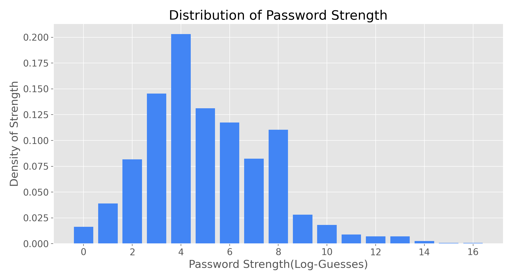
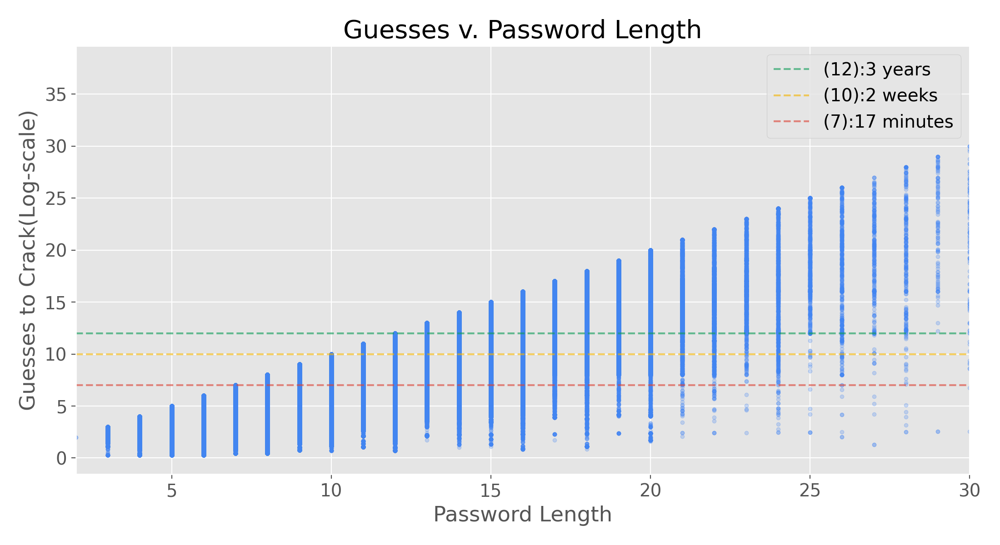

# Context

One day we all get the message -
A notification that beems across your phone or chimes into your inbox. . .

>Dear Customer, \
we’re letting you know that we detected unusual activity on your account and are taking action to. . .

“Was my information stolen from my bank, my employer, or that one website I love to read at night”? [website](#website)

How the bad-guys managed to steal or purchase your information, you’ll never know for sure.  But of all the ways you can better protect you and your family against cyber criminals, there is one advice you’ve heard the most.  And it’s also the one you’ve agreed with the most, told yourself you’d commit to it, and then promptly forgot about again. . .

at least until the news of another data breach slides across your phone. [^breachnotice]

Create a strong password!

---
So what really makes a strong password anyway?

- Is it having a specific date that you haven’t told anyone?
- Is it the amount of fancy characters you can find on your keyboard?
- Or perhaps the cat ladies of the world have the true secret to fighting cyber criminals after all - just make a password with all of the names of your cats :smiley_cat:.[^cat_lady]

## Data

The datasets used in this project provide a variety in both source, context, and size.  The passwords are sourced from notable data breaches such as Linkedin [^linkedin_count] and Rock You, as well as an aggregate database totaling over 560 million passwords.[^ibeenpwned]  My datasets are facially simple - they are a collection of either the passwords in plaintext form.  All other features were derived by analyzing the password plaintext (e.g length of password and count of lowercase letters used).

Two other features highlighted during this analysis was an overall score from 0-4 to represent how strong each password was, as well as an estimate for how many guesses a motivated hacker would need before breaking each password.[^zxcvbn]

---

## Goals & Minimum Viable Product

1. Create a novel data pipeline to prepare the datasets to a common standard.
2. Practice methods of data manipulation that scale well with datasets in excess of 3-25GB (e.g. Dask, PySpark, RAPIDS)
3. Create code using Object-Oriented Principles that can be further developed in future capstones and open-source projects.

**But more importantly**

1. Provide you examples of strong and weak passwords.
2. Help you understand how to make a strong password
3. Motivate you never again have ~~low-hanging fruit~~ weak passwords for a hacker to profit from.

## Data Description

1. The dataset we'll be focusing on for this first project comes from the [10-million passwords](https://xato.net/today-i-am-releasing-ten-million-passwords-b6278bbe7495) dataset generously published by [Mark Burnett](https://medium.com/@m8urnett/about)[^Mark]
2. The dataset was composed of 10-million unique passwords
3. 

## Data Pipeline

My dataset for this project had only the password plaintext available as a feature, so all analysis had to occur from creating new features.

Features
   1. length of password
   2. count of character types used
      - lowercase, numbers, uppercase, symbols
   3. guesses_log10
      - Estimate of password strength
      - Estimated number of max guesses to identify a password
   4. score
      1. Simplified version of guesses
      2. Useful as feedback during new-password creation
      3. Promotes stronger passwords

| Guesses_log | Time to Crack| Score  |
| ----:       | -----------: |:-----: |
|  14         |  <300 years  |        |
|  13         |   30 years   |        |
|  12         |    3 years   |        |
|  11         |    4 months  |    4   |
|  10         |    2 weeks   |    3   |
|  8          |    3 hours   |    2   |
|  7          |   10 minutes |    1   |
|  6          |   <1 minutes |    0   |

## Data Exploration

### Figure 1 - password lengths bar chart

1. note min length = 4
2. 

### Figure 2 - strength bar chart

1. introduce concept of Strength (log-guesses)
2. Table: Strength - time to crack
3. explain a pass length=10 can be strength<10

### Figure 3 - Characters used in passwords

[^giph_maker]

### Figure 4 - Guesses v length

## Password Recommendations
----

Try out the Password Strength Tool \
[(Not Yet Implemented)](https://business-wizard.github.io/password_strength_capstone01/)!

1. For less important, but commonly used passwords
   - Length > 20
   - Combine 4 or more **uncommon** words
   - for a memorable phrase that you can imagine
   - Add symbols and numbers between each word
2. Important accounts you can't afford to have stolen
   - Length 18-30
   - Use random generator with all possible characters
   - Password manager to store your passwords
   - The length is only limited by the company requirements because the password manager will remember it for you
3. While a few companies are using effective password strength indicators such as Dropbox's [zxcvbn](https://github.com/dropbox/zxcvbn), most of them are unreliable!

### Password Examples

>Note: some of the following passwords 

### Weak

| Password   | Length|  Score |Guesses_log|
| ---:       | :---: |  :---: |  ----:    |
|Auntlaurie1!|   12  |    3   |  8.40     |
|011235813   |    9  |    1   |  4.54     |
|13741374Zz  |   10  |    2   |  6.47     |  
|andrew2222  |   10  |    1   |  4.18     |  
|republican  |   10  |    0   |  2.99     |  
|bigdaddy66  |   10  |    1   |  4.42     |  
|bobpremium  |   10  |    2   |  6.25     |  
|London1765  |   10  |    1   |  5.98     |  
|lalakers24  |   10  |    1   |  5.99     |  
|orwell1984  |   10  |    1   |  5.88     |  
|boomboomk0  |   10  |    1   |  5.72     |  
|123456789m  |   10  |    1   |  3.71     |
---
### Short

| Password  | Length|  Score |Guesses_log|
| ---:      | :---: |  :---: |  :----    |
|**Tr0ub4dor&3**|11 |    4   |   11.00   |
|A@%^b27C$d1|   11  |    4   |   11.00   |
|iyswtric04 |   10  |    3   |   10.00   |
|balamelnur |   10  |    3   |   10.00   |
|varfalamei |   10  |    3   |   10.00   |
|0jNsyTDAhn |   10  |    3   |   10.00   |
|ifEbevodEH |   10  |    3   |   10.00   |
|mortecouil |   10  |    3   |    9.56   |
|greWEGWegw |   10  |    3   |    9.60   |
|ni5mlnuken |   10  |    3   |    9.68   |
|wildhack43 |   10  |    3   |    9.05   |

---

### Long

| Password            | Length|  Score |Guesses_log|
| ---:                | :---: |  :---: |  :----    |
|qwertyuiopqwertyuiop |   20  |    0   |   1.67    |
|qwertyuioppoiuytrewq |   20  |    1   |   4.18    |
|1705secret1705secret |   20  |    2   |   6.38    |
|1234567890qwertyuiop |   20  |    1   |   4.18    |
|drPASSWORDdrPASSWORD |   20  |    1   |   4.60    |
|98765432100123456789 |   20  |    1   |   4.26    |
|bla_bla_84bla_bla_84 |   20  |    2   |   6.90    |
|11111111111111111111 |   20  |    0   |   2.38    |
|wizard.123wizard.123 |   20  |    2   |   6.85    |
|qqqqqqqqqqqqqqqqqqqq |   20  |    0   |   2.38    |

### Strong

| Password                       | Length|Score|Guesses_log|
| ---:                           | :---: |:---:|  :----    |
|**correcthorsebatterystaple**   |   24  |  4  |   14.4    |
|**correct_horse_battery_staple**|   27  |  4  |   20.3    |
|jagjagarmed13hundar             |   21  |  4  |   15.18   |
|A9FADBE93A7C326FA97B            |   20  |  4  |   20.0    |
|ldtnsczxbjlbyyflwfnm            |   20  |  4  |   20.0    |
|ZeKqusrQ2BhicQbc4Y7I            |   20  |  4  |   20.0    |
|y3fk86egsJ66Kz1MMu8s            |   20  |  4  |   20.0    |
|vitulya.poddubnaya83            |   20  |  4  |   20.0    |
|1516producchuotlaanh            |   20  |  4  |   20.0    |
|t43ty34tt2t43t34t324            |   20  |  4  |   20.0    |
|FPuw0ReC^CachyZe34q5            |   20  |  4  |   20.0    |

[Password Strength Indicator](https://lowe.github.io/tryzxcvbn/) hosted on another website that you can use to improve your passwords.

## Next Steps - Next Features to add

1. Add Password Strength Indicator to Project Website
2. Finish capability for pipeline to use multiple cores
     - Dask, Rapids, Spark as options
3. Standardize larger datasets for use in future research.
4. Explore use of Machine Learning models such as LSTM and Markov based models.

### Motivating Research & Extended Resources

1. [A Machine Learning Approach to Predicting Passwords -Christoffer Olsen](http://www2.imm.dtu.dk/pubdb/edoc/imm7088.pdf)
2. [PassGAN: A Deep Learning Approach for Password Guessing](https://arxiv.org/pdf/1709.00440.pdf)
3. [hashcat](https://hashcat.net/hashcat/)
4. [hashcat setup guide for Ubuntu](https://www.alexanderjsingleton.com/infosexy-how-to-use-hashcat-to-crack-passwords-in-ubuntu-18-04/)
5. [Comparison of Dictionary Attack Rulesets](https://notsosecure.com/one-rule-to-rule-them-all/)

---
#### Footnotes

<a name="xkcd"> website </a>: [xkcd](https://xkcd.com/2374/)

[^breachnotice]: Months after the breach occured

[^cat_lady]: If you have less than four, read on

[^linkedin_count]: 61 million passwords

[^ibeenpwned]: [Aggregate Dataset of Password](https://haveibeenpwned.com/)

[^Mark]: IT security analyst and author

[^zxcvbn]: Made possible by the work of [Dan Wheeler](https://dropbox.tech/security/zxcvbn-realistic-password-strength-estimation)

[^giph_maker]: [giph maker](https://ezgif.com/maker)
